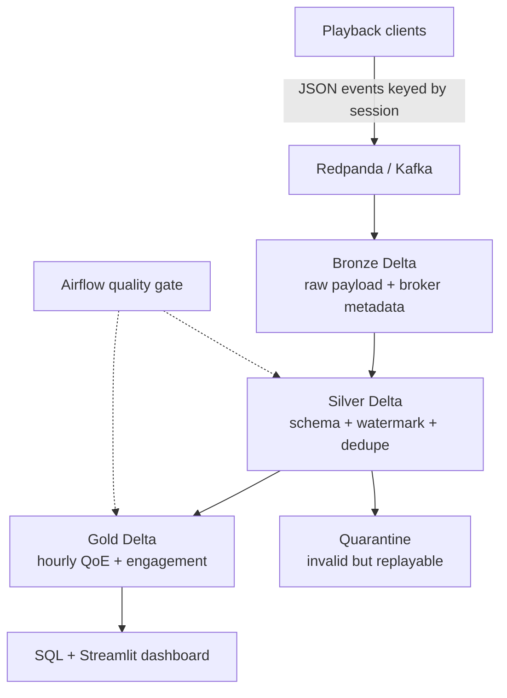

# StreamPulse — real-time streaming analytics lakehouse

[](https://www.python.org/)
[](https://spark.apache.org/)
[](https://delta.io/)
[](.github/workflows/ci.yml)
[](LICENSE)

StreamPulse is an end-to-end data engineering portfolio project inspired by modern video-streaming platforms. It converts raw playback telemetry into trusted engagement and quality-of-experience (QoE) metrics using Kafka-compatible ingestion, Spark Structured Streaming, Delta Lake, SQL, Airflow, and Streamlit.

The repository has two paths:

- **Five-minute local demo:** dependency-free Python materializes Bronze, Silver, quarantine, and Gold outputs from deterministic sample data.
- **Production-shaped streaming path:** Redpanda/Kafka → three checkpointed Spark streams → Delta Lake → BI/SQL consumers.

## What this project demonstrates

- Python engineering with typed, testable modules and deterministic fixtures.
- Stateful Spark streaming with explicit schemas, watermarks, deduplication, checkpoints, and late-data tradeoffs.
- Medallion data modeling with raw replayability, quality quarantine, and consumer-ready marts.
- Idempotent Gold upserts with Delta `MERGE` for revisable event-time windows.
- SQL analytics using CTEs, window functions, `QUALIFY`, safe division, and approximate quantiles.
- Airflow as a control plane for bounded quality and maintenance work—not as an event-by-event streaming engine.
- Data quality, CI, privacy-aware identifiers, observability targets, and honest scope boundaries.

## Architecture



| Layer | Purpose | Important design choice |
|---|---|---|
| Event source | Synthetic playback telemetry | `session_id` is the partition key to preserve session ordering |
| Bronze | Immutable system of record | Retains payload, topic, partition, offset, and broker timestamp for replay/lineage |
| Silver | Trusted event fact | Explicit contract, null-safe quality predicate, 15-minute watermark, `event_id` dedupe |
| Quarantine | Recoverable quality failures | Invalid records are isolated rather than silently dropped |
| Gold | Content and platform marts | Open hourly windows are idempotently merged as valid late data arrives |
| Serving | Analyst and operator views | BigQuery SQL examples plus a filterable Streamlit dashboard |

## Data product and KPIs

The input contract models playback starts, progress, completions, and errors across devices, countries, subscription tiers, sessions, and content. It intentionally excludes names, emails, and IP addresses.

| KPI | Business use |
|---|---|
| Playback starts and unique viewers | Reach and demand |
| Watch hours | Engagement and content performance |
| Completion rate | Content resonance and funnel health |
| Startup latency | Time-to-first-frame experience |
| Rebuffer ratio | Playback smoothness |
| Error rate | Reliability and incident impact |
| Explainable QoE score | Fast prioritization across market/device segments |

See the full [data dictionary](docs/DATA_DICTIONARY.md), including exact formulas and limitations.

## Quick start: run the whole local pipeline

Requirements: Python 3.10+ and `make`. No broker, JVM, or Python packages are needed for this path.

```bash
git clone https://github.com/<your-username>/streaming-platform-analytics.git
cd streaming-platform-analytics
make demo
make test
```

The deterministic demo intentionally sends 250 good events, one retry duplicate, and one contract violation:

```json
{
  "duplicate_records": 1,
  "gold_content_daily_rows": 60,
  "gold_platform_hourly_rows": 74,
  "input_records": 252,
  "quality_pass_rate": 0.9921,
  "quarantined_records": 1,
  "valid_records": 250
}
```

Generated outputs:

```text
output/
├── bronze/playback_events.ndjson
├── silver/playback_events.ndjson
├── quarantine/playback_events.ndjson
├── gold/content_daily.csv
├── gold/platform_hourly.csv
└── run_summary.json
```

To open the dashboard:

```bash
python -m venv .venv
source .venv/bin/activate          # Windows: .venv\Scripts\activate
pip install -e '.[dashboard]'
make demo
make dashboard
```

## Run the Kafka + Spark path

Requirements: Docker, Java 17, Python 3.10+, and approximately 3 GB of free memory.

```bash
python -m venv .venv
source .venv/bin/activate
pip install -e '.[stream,spark]'
cp .env.example .env
make broker-up
make sample
```

Start each long-running job in its own terminal. Start Bronze first, publish the sample, then start Silver and Gold after their upstream Delta path exists.

```bash
# Terminal 1
python -m streaming_analytics.spark.bronze_stream

# Terminal 2: publish after Bronze is listening
make produce

# Terminal 3
python -m streaming_analytics.spark.silver_stream

# Terminal 4
python -m streaming_analytics.spark.gold_stream
```

Redpanda Console is available at `http://localhost:8080`. Stop local services with `make broker-down`.

## Reliability and correctness

- **At-least-once delivery:** producer retries are expected; Silver deduplicates on `event_id`.
- **Event-time processing:** metrics use `event_ts`, not arrival time, with a bounded 15-minute state horizon.
- **Restart safety:** every stream owns a durable checkpoint and Bronze retains broker coordinates.
- **Invalid data:** contract failures remain replayable in quarantine and never contaminate Gold.
- **Idempotent aggregation:** `foreachBatch` merges on window plus business dimensions.
- **Safe metrics:** zero-denominator guards prevent invalid rates; QoE penalties are documented and capped.
- **Reconciliation:** the local integration test verifies record counts through daily and hourly marts.

The watermark is a product/SLA decision, not a magic constant. A production deployment should choose it from observed event-lateness percentiles, then route records beyond that threshold to a correction workflow.

## Cloud deployment mapping

| Local component | GCP implementation | Databricks implementation |
|---|---|---|
| Redpanda / Kafka | Pub/Sub or managed Kafka | Event Hubs / Kafka / Kinesis source |
| Spark streams | Dataproc Serverless or Spark on GKE | Databricks Structured Streaming / Lakeflow |
| Delta files | GCS + Delta or BigLake | Managed Delta tables in Unity Catalog |
| Gold serving | BigQuery | Databricks SQL warehouse |
| Airflow quality gate | Cloud Composer | Databricks Workflows or Airflow |
| Metrics and alerts | Cloud Monitoring | System tables + Lakehouse Monitoring |

For a GCP-first version, Bronze/Silver can remain on GCS while curated Gold tables are published to BigQuery. That preserves replayable object storage and gives analysts familiar SQL performance. For a Databricks-first version, all layers can remain in Delta under Unity Catalog, with Gold served through Databricks SQL.

## Repository map

```text
streaming-platform-analytics/
├── src/streaming_analytics/
│   ├── contracts.py              # Versioned event quality rules
│   ├── generator.py              # Deterministic synthetic events
│   ├── local_pipeline.py         # Fast Bronze/Silver/Gold demo
│   ├── metrics.py                # Shared KPI definitions
│   ├── producer.py               # Kafka-compatible event replay
│   └── spark/                    # Bronze, Silver, and Gold streams
├── airflow/dags/                 # Scheduled quality control plane
├── dashboard/app.py              # Streamlit serving layer
├── data/sample/events.ndjson     # Committed reproducible fixture
├── sql/analytics_queries.sql     # BigQuery analysis examples
├── tests/                        # Contract, metric, and pipeline tests
├── docs/                         # Dictionary, milestones, interview guide
├── .github/workflows/ci.yml      # Tests plus reproducible demo
└── docker-compose.yml            # Redpanda broker and console
```

## Implementation milestones

The [implementation plan](docs/IMPLEMENTATION_MILESTONES.md) defines six measurable milestones: contract and fixtures, durable ingestion, trusted Silver, business-ready Gold, operations/observability, and cloud scale testing. Each includes a definition of done and the engineering signal it demonstrates.

## Interview walkthrough

The [interview guide](docs/INTERVIEW_GUIDE.md) includes a concise project story, design tradeoffs, failure scenarios, and an explicit scope statement. The strongest discussion points are:

- event-time correctness versus state-store cost;
- exact versus approximate distinct counts in low-latency aggregation;
- raw replayability versus retention cost and privacy risk;
- hot-key mitigation for premiere traffic;
- streaming jobs versus scheduled control-plane work;
- why late events require upserts instead of append-only Gold output.

## Tests and CI

```bash
make test     # contract, KPI, dedupe, quarantine, and end-to-end tests
make lint     # syntax/bytecode validation without third-party dependencies
```

GitHub Actions additionally runs Ruff and regenerates the local pipeline from the committed seed. The repository does **not** claim production throughput, latency, availability, or cost benchmarks; those belong in the scale milestone after measurement.

## License

MIT — see [LICENSE](LICENSE).
